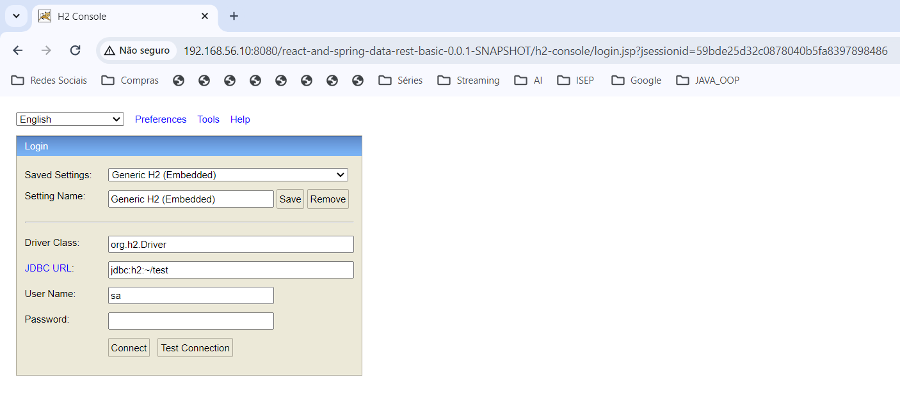
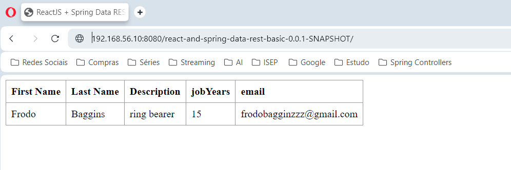

DevOps CA3 - Part 2 Report
===================

## Table of Contents

1. [Introduction to the class assignment]
2. [Setting up the environment]
3. [Implementation of the class assignment]
4. [Testing the implementation of the class assignment]
5. [Alternative implementation]
6. [Conclusion]

# Introduction to the class assignment

* Virtualization is a technology that allows you to create multiple simulated environments or dedicated resources from a
  single, physical hardware system.
* It's a way of maximizing physical resources to get the most out of the investment in hardware.
* Vagrant, on the other hand, is an open-source software product for building and maintaining portable virtual software
  development environments.
* It simplifies software configuration management and its main purpose is to provide developers with easy-to-setup,
  reproducible, and portable work environments.
* In this class assignment, we will explore the concept of virtualization with a focus on Vagrant.
* We will delve into how Vagrant can be used to create and manage virtual machines with ease.
* We will learn about the Vagrantfile, which is a fundamental aspect of Vagrant that allows us to describe the type of
  machine we want, how to configure it, and what software to install.
* We will also learn how to use Vagrant boxes, which are prepackaged development environments that are ready for use.
* This will include learning how to initialize a new Vagrant environment, how to boot a Vagrant box, and how to SSH into
  the box for making necessary changes.
* Furthermore, we will explore how to synchronize folders between the host machine and the Vagrant box, allowing us to
  continue working on our files on our host machine and have those changes reflect within the box.
* By the end of this assignment, you will have a solid understanding of virtualization and how to use Vagrant to create
* and manage your virtual environments.
* This knowledge will be invaluable as you continue your journey in software development, as it will allow you to easily
  create reproducible development environments that can be shared with others, thus eliminating the "but it works on my
  machine" problem.

## Setting up the environment

* In the following steps it will be shown how to set up the environment for the class assignment, including the
  installation of Vagrant in the local machine and the cloning of the repository from Bitbucket.
* Particularly, the Vagrantfile will be copied from the vagrant-multi-spring-tut-demo folder to the new CA3/Part2
  folder.

**1** Clone the BitBucket repository to a directory in your local machine, in this case, the Desktop:

```bash
$ git clone https://bitbucket.org/pssmatos/vagrant-multi-spring-tut-demo.git
```

**2** Extract the vagrant file from the cloned repository to the desired directory, in this case, the
DevOpsRepository/CA3/Part2 folder:

```bash
cp -r Desktop/vagrant-multi-spring-tut-demo/vagrantfile 11_04_2024DevOps/CA3/Part2
```

**3** Install Vagrant via the official website, following the instructions for the specific operating system, in my case
Windows AMD64 installer

```browser
https://developer.hashicorp.com/vagrant/install?product_intent=vagrant
```

## Implementation of the class assignment

* In order to execute the 'vagrant up' command correctly, the Vagrantfile was edited to change the base box to "
  generic/ubuntu2204" for both VMs,
* Java version to "openjdk-17-jdk-headless",
* H2 Database version to "h2-2.2.224.jar",
* Tomcat version to "10.1.23".
* Project deployment was also changed to a specific project cloned from the personal repository, as well as the build
  and deployment of the war file.

* Make your repository public, so that the Vagrantfile can be accessed by the Vagrant command.
* You can do so by going to the repository settings, then to the General tab, and changing the visibility to Public.

**Vagrant file modification 1**: Update the Base Box for Virtual Machines The base box for both the database and web
server
virtual machines (VMs) needs to be updated to "generic/ubuntu2204".
This is done to utilize a more recent version of Ubuntu.

**Vagrant file modification 2**: Modify the Java Version The Java version that is currently being downloaded needs to be
updated to "openjdk-17-jdk-headless".
This is the compatible version of Java for the Tomcat version that will be used in the web server VM.

**Vagrant file modification 3:** Alter the H2 Database Version The version of the H2 Database that is being downloaded
needs
to be changed to "h2-2.2.224.jar".
This is a more recent version of the H2 Database, which offers enhanced stability and performance, and is the one
compatible with the Java version being used.

**Vagrant file modification 4:** Change the Tomcat Version The version of Tomcat that is being downloaded needs to be
updated to "10.1.23".
This is a more recent version of Tomcat, which provides improved performance and additional features.

**Vagrant file modification 5:** Modify Project Deployment
The project deployment was altered from a sample project to a specific project, sourced from the repository used in the
DevOps class.
This modification was implemented to facilitate the deployment of a distinct project onto the web server virtual
machine.
Additionally, the build process and deployment of the war file were adjusted to align with this change.

```bash
$   # Change the following command to clone your own repository!
      git clone https://github.com/TiagoPires25/devops-23-24-JPE-PSM-1231862.git
      cd devops-23-24-JPE-PSM-1231862/CA2/Part2/react-and-spring-data-rest-basic
      chmod u+x gradlew
      ./gradlew clean build
      # To deploy the war file to tomcat9 do the following command:
      sudo cp ./build/libs/react-and-spring-data-rest-basic-0.0.1-SNAPSHOT.war /opt/tomcat/webapps
      cd
      cd /opt/tomcat/bin
      ./startup.sh
   SHELL
end

```

Following the modification of the Vagrantfile, several additional steps were undertaken to ensure the proper functioning
of the application and the two virtual machines (VMs).
These steps were performed within the CA2/Part2/react-and-spring-data-rest-basic directory.
Below is a brief overview of the changes made to the project to enable the deployment of the application on the web
server VM.

**HTML File Modification:** The index.html file, which serves as a template for the Single-Page Application (SPA), was
updated to modify the access to an external stylesheet using a relative path.

**Servlet Initializer Creation:** A ServletInitializer.java file was created to configure the Spring application to run
on a
servlet container, specifically Tomcat.

**Gradle Build File Modification:** The build.gradle file was updated to include the war plugin, enabling the
application to
be packaged as a Web Application Archive (WAR) file for deployment on a servlet container like Tomcat.
Additionally, the dependencies section was updated to include libraries necessary for deploying the application as a WAR
file on Tomcat.

**Application Properties Update:** The application.properties file was updated to configure the application's connection
to
the H2 database.
This included setting the context path, configuring the base path for the Rest API endpoints, specifying the database
connection URL, and enabling the H2 web console.

**JavaScript File Update:** The app.js file was modified to update the path used by a React component to fetch data from
the
Spring Data REST API endpoint.

In the end commit all the changes to the repository, using the following commands:

```bash
$ git add .
$ git commit -m "[feat]: add necessary changes in order to perform CA3- Part2 Fixes #IssueNumber"
```

## Testing the implementation of the class assignment

During this phase, the Vagrantfile was employed to set up two virtual machines - one dedicated to the database and the
other serving as a web server.
The successful operation of the application was confirmed by executing it and accessing it via a web browser.

**Launching the Application:** To initiate the application, navigate to the directory containing the Vagrantfile and
execute
the command vagrant up.

```bash
$ vagrant up
```

**Checking VM Status:** Once the virtual machines are up and running, their status can be verified using the command
vagrant
status.

```bash
$ vagrant status
```

**Accessing the H2 Database Console:** The H2 database console can be accessed via a web browser using the following
URL.
This allows for browsing the database, executing SQL queries, and managing the database.

```browser
http://192.168.56.10:8080/react-and-spring-data-rest-basic-0.0.1-SNAPSHOT/h2-console"
```



**Verifying Database Data:** To confirm the data within the database, the following URL can be used in a web browser.

```browser
http://192.168.56.10:8080/react-and-spring-data-rest-basic-0.0.1-SNAPSHOT/
```



**Destroying the VMs and Cleaning Up:** To destroy the virtual machines and delete the /vagrant folder, the following
commands can be used.

```bash
$ vagrant destroy -f
```

## Alternative implementation

Hyper-V is a native hypervisor from Microsoft, available on Windows systems. It allows you to create and manage virtual
machines (VMs) on a single physical machine.
With Hyper-V, you can run multiple operating systems simultaneously, which is particularly useful in development
environments where you need to test applications across different systems.

**Advantages of Hyper-V**

* Performance: As a Type 1 hypervisor, Hyper-V runs directly on the system hardware, which can lead to better
  performance compared to Type 2 hypervisors like VirtualBox that run on the host operating system.
* Integration with Windows: Being a Microsoft product, Hyper-V is well-integrated with the Windows operating system.
  This can lead to a smoother user experience and better compatibility with Windows-based applications.
* Advanced Features: Hyper-V comes with advanced features such as live migration of VMs, high availability, and dynamic
  memory management.

**Disadvantages of Hyper-V**

* Limited Cross-Platform Support: Hyper-V is available only on Windows, which can be a limitation if you work in a
  cross-platform environment.
* Hardware Requirements: Hyper-V requires hardware virtualization support (Intel VT-x or AMD-V) to be enabled in the
  BIOS. This might not be available on older systems.
* Complex Setup: Setting up VMs in Hyper-V can be more complex compared to VirtualBox, especially for beginners.

**Comparison with VirtualBox**

* VirtualBox is a popular Type 2 hypervisor known for its simplicity and cross-platform support. It runs on Windows,
  Linux, and macOS, making it a versatile choice for developers working in diverse environments.
* However, as a Type 2 hypervisor, VirtualBox may not offer the same level of performance as Hyper-V.
* It runs on the host operating system, which can lead to additional overhead and potentially slower performance.
* In terms of features, VirtualBox lacks some of the advanced capabilities of Hyper-V, such as live migration and high
  availability.
* However, it does offer a straightforward and user-friendly interface, which can be a significant advantage for
  beginners or those with simpler virtualization needs.

**Implementation of the Class Assignment**

* In order to set up the environment using Hyper-V, the following steps must be followed:
* Enable Hyper-V: First, you need to ensure that Hyper-V is enabled on your system. You can do this by going to "Turn
  Windows features on or off" in the Control Panel and checking the box for Hyper-V.
* Create Virtual Machines: Using the Hyper-V Manager, create two new virtual machines. One will serve as the database
  server and the other as the web server. You can choose the operating system for these VMs according to your project
  requirements.
* Configure Virtual Machines: Configure the settings of the virtual machines to match the requirements of your project.
  This includes setting the amount of memory, number of processors, and network settings.
* Install Necessary Software: On each VM, install the necessary software for your project. This could include Java,
  Tomcat, and the H2 Database, among others.
* Clone the Repository: Clone your project repository onto the web server VM.
* Build and Deploy the Project: Navigate to the project directory and build the project. Once the build is successful,
  deploy the WAR file to Tomcat.
* Configure Database Connection: Update the application.properties file in your project to point to the database server
  VM.
* Test the Application: Access the application in a web browser to ensure it is running correctly. You can also connect
  to the H2 database console to verify the database connection and data.

The choice between Hyper-V and VirtualBox depends on your specific requirements. If you need high performance and
advanced features, and you're primarily working on Windows, Hyper-V could be the better choice.
If you value cross-platform support and ease of use, or if you're just getting started with virtualization, VirtualBox
might be more suitable.

Sources:

- https://www.acecloudhosting.com/blog/hyper-v-vs-virtualbox/
- https://pt.wikipedia.org/wiki/Hyper-V

## Conclusion

This document has provided a comprehensive guide on how to set up, implement, and test a virtualized development
environment using Vagrant, a powerful tool for managing virtual machines.
The guide walked through the process of setting up two virtual machines, one for a database server and another for a web
server, using a Vagrantfile.
It also detailed the modifications made to the project to enable its deployment on the web server VM.

The document further explored the concept of virtualization, its benefits, and how Vagrant simplifies the process of
creating and managing virtual environments.
It highlighted the importance of such environments in software development, particularly in ensuring consistency across
different systems and eliminating the "it works on my machine" problem.
In addition, the document provided an alternative implementation using Hyper-V, a native hypervisor from Microsoft.

It discussed the advantages and disadvantages of Hyper-V compared to VirtualBox, another popular virtualization tool.
The choice between the two depends on specific requirements, such as performance needs, cross-platform support, and ease
of use.  
The steps and modifications detailed in this document are specific to the project at hand, which involved technologies
such as Java, Spring Boot, Maven, React, and Gradle.
However, the principles and procedures can be applied to other projects and technologies, demonstrating the versatility
of Vagrant and virtualization in general.

In conclusion, virtualization is a crucial aspect of modern software development. Tools like Vagrant and Hyper-V make it
easier to manage virtual environments, leading to more efficient and reliable development processes. As such,
understanding and utilizing these tools can be highly beneficial for developers in various contexts.

**Final note**:
In order to ensure proper function and demonstration of the CA2, add to comment some parts of 
application.properties, all lines but the following:
```properties
spring.data.rest.base-path=/api
```

app.js comment these lines:
```javascript
componentDidMount() { // <2>
  client({method: 'GET', path: '/react-and-spring-data-rest-basic-0.0.1-SNAPSHOT/api/employees'}).done(response => {
    this.setState({employees: response.entity._embedded.employees});
  });
}
```

index.html comment the following line:
```html
<link rel="stylesheet" href="main.css" />
```

All the code is commented to provide clarity and avoid any issues during the demonstration.