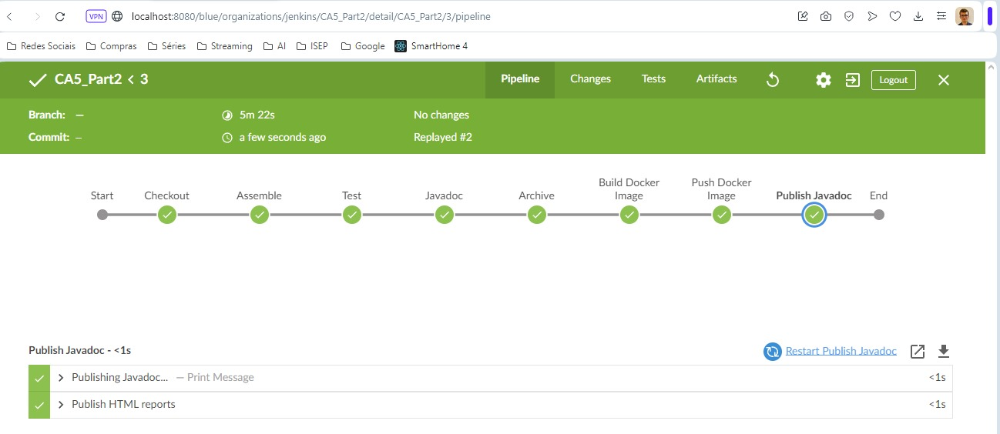
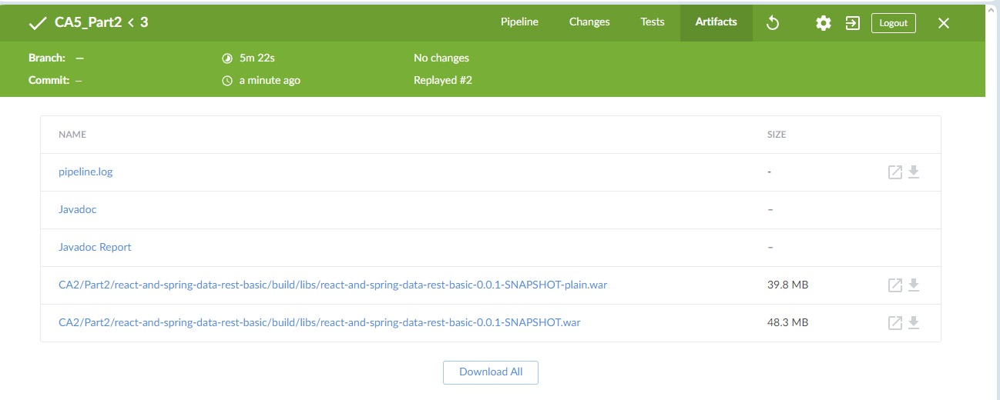

DevOps CA4- Part 2 Report
===================

## Table of Contents

1. [Introduction to the class assignment]
2. [Practice and Jenkins installation]
3. [Implementation of the first Jenkinsfile]
4. [Implementation of the second Jenkinsfile]
5. [Conclusion]

# Introduction to the class assignment

The primary objective of this assignment is to gain practical experience with Jenkins by creating and managing CI/CD pipelines for a Java project using Gradle. 
The project in focus is the "gradle basic demo" that should already be present in your individual repository as it was done in the previous assignments.
The assignment is divided into two main parts:
Part one involves creating a simple pipeline similar to the example provided in the lectures.
Part two extends this pipeline to build the Spring Boot application developed in Class Assignment 2 (CA2), Part 2.
The pipeline stages include code checkout, assembly (compilation and archive file generation), unit testing, Javadoc generation, archiving of the generated files, and Docker image publication. 
Each stage is designed to provide hands-on experience with key aspects of CI/CD pipelines.
This README file serves as the technical report for this assignment.
It provides detailed instructions and explanations for each task, enabling you to replicate the functionalities implemented in this assignment. 
By following these instructions, you will gain a comprehensive understanding of CI/CD pipelines and their implementation using Jenkins. 

## Practice and Jenkins installation

Before starting the assignment, it is essential to practice the concepts covered in the lectures and tutorials.
This practice will help you understand the basic principles of Jenkins and how to create and manage pipelines.

I used the following website: https://www.jenkins.io/doc/book/installing/windows/ to install Jenkins on my Windows machine.
As I am using Windows, I followed the instructions for Windows installation, you may follow the instructions for your operating system.

The main steps for installing Jenkins on Windows are as follows:

Starting the Jenkins Container:
Use the docker run command to launch a Jenkins container in detached mode (-d) with several important options:
**-v jenkins_home:/var/jenkins_home**: This maps a volume named jenkins_home on your host machine to the /var/jenkins_home directory within the container. This volume persists Jenkins data, allowing you to keep your configurations and plugins even if the container restarts.
**-p 8080:8080**: This maps port 8080 on your host machine to port 8080 inside the container, making Jenkins accessible through http://localhost:8080/.
**-p 50000:50000**: This maps port 50000 on your host machine to port 50000 in the container. This port is used for Jenkins' slave-to-master communication (not always necessary).
**--restart=on-failure**: This tells Docker to automatically restart the container if it encounters any issues.
**jenkins/jenkins:lts-jdk17**: This specifies the Docker image you used, which includes Jenkins pre-configured with Java 17 (LTS stands for Long-Term Support).
Initial Jenkins Setup (Without Password Display):

While I retrieved the password using docker logs, it's generally not recommended to expose sensitive information like passwords in logs. Instead, most Docker images for Jenkins provide an alternative way to access the initial password. This can often be found in the container's documentation or by searching online for the specific image you used. These methods might involve checking log files within the container or using environment variables.
Creating an Admin User and Installing Plugins:

Once you had the initial password (obtained securely), you create the first administrative user in Jenkins with your credentials.
You then proceed to install the recommended plugins to enhance Jenkins functionality for your project.


## Implementation of the first Jenkinsfile
Firstly I created a CA5 folder to which I will add both Jenkinsfiles needed for this assignment.
Then I created the Jenkins file for the first part of the assignment
Now I will go through the Jenkinsfile and explain each part of it:

```groovy
pipeline {
    agent any 
  ```
The pipeline block defines the entire Jenkins pipeline. It contains all the stages and steps that Jenkins will execute.
The agent any directive tells Jenkins to allocate an executor for the pipeline, regardless of the type of agent.
```groovy
        stages {
    stage('Checkout') {
        steps {
            echo 'Checking out the code..'
            git 'https://github.com/TiagoPires25/devops-23-24-JPE-PSM-1231862'
        }
    }
```
The stages block contains all the stages of the pipeline. Each stage represents a distinct phase of the build process.
The stage directive defines a stage named Checkout. This stage checks out the code from the GitHub repository.
The steps block contains the individual steps that Jenkins will execute within the stage.
The echo command prints a message to the Jenkins console log.
The git step clones the code repository from the specified URL.

```groovy
  stage ('Assemble') {
    steps {
        echo 'Assembling the project..'
        dir('CA2/Part1/gradle_basic_demo') {
            sh 'chmod +x gradlew'
            sh './gradlew clean assemble'
        }
    }
}
```
The stage directive defines a stage named Assemble. This stage assembles the project by running the Gradle build script.
The dir step changes the working directory to the specified path.
The sh step executes shell commands within the specified directory.
The chmod command changes the permissions of the Gradle wrapper script to make it executable.

```groovy
        stage ('Test') {
    steps {
        echo 'Testing the project..'
        dir('CA2/Part1/gradle_basic_demo') {
            sh './gradlew test'
        }
    }
    post {
        always {
            junit 'CA2/Part1/gradle_basic_demo/build/test-results/test/*.xml'
        }
    }
}
```
The stage directive defines a stage named Test. This stage runs the unit tests for the project.
The post directive specifies actions to be taken after the stage completes, regardless of the outcome, in this case, publishing the JUnit test results.
The always block ensures that the specified actions are executed even if the stage fails.

```groovy
  stage ('Archive') {
    steps {
        echo 'Archiving the project..'
        archiveArtifacts 'CA2/Part1/gradle_basic_demo/build/distributions/*'
    }
}
```

The stage directive defines a stage named Archive. This stage archives the project artifacts for future reference.
The archiveArtifacts step archives the specified files or directories.
To run the script you must go to Jenkins and create a new pipeline, then you must select the pipeline script from SCM and add the repository URL and the branch you want to use.


## Implementation of the second Jenkinsfile
Now I will go through the second Jenkinsfile and explain each part of it:

```groovy
pipeline {
agent any

    environment {
        DOCKER_CREDENTIALS_ID = 'docker_hub_credentials'
        DOCKER_IMAGE = "tiagopires1862/ca5part2:${env.BUILD_ID}"
    }
```
The pipeline block defines the entire Jenkins pipeline. It contains all the stages and steps that Jenkins will execute.
The agent any directive tells Jenkins to allocate an executor for the pipeline, regardless of the type of agent.
The environment block defines environment variables that will be available to all stages in the pipeline. 
In this case, it specifies the Docker credentials ID and the Docker image name.

```groovy
     stages {
        stage('Checkout') {
            steps {
                git  'https://github.com/TiagoPires25/devops-23-24-JPE-PSM-1231862'
            }
        }
```
The stages block contains all the stages of the pipeline. Each stage represents a distinct phase of the build process.
The stage directive defines a stage named Checkout. This stage checks out the code from the GitHub repository.

```groovy
         stage('Assemble') {
    steps {
        dir('CA2/Part2/react-and-spring-data-rest-basic') {
            sh 'chmod +x ./gradlew'
            sh './gradlew clean assemble'
        }
    }
}
```
The stage directive defines a stage named Assemble. This stage assembles the project by running the Gradle build script.
The dir step changes the working directory to the specified path.
The sh step executes shell commands within the specified directory.
The chmod command changes the permissions of the Gradle wrapper script to make it executable.

```groovy
    stage('Test') {
    steps {
        dir('CA2/Part2/react-and-spring-data-rest-basic') {
            sh './gradlew test'
        }
    }
    post {
        always {
            junit 'CA2/Part2/react-and-spring-data-rest-basic/build/test-results/test/*.xml'
        }
    }
}
```
The stage directive defines a stage named Test. This stage runs the unit tests for the project.
The post directive specifies actions to be taken after the stage completes, regardless of the outcome, in this case, publishing the JUnit test results.
The always block ensures that the specified actions are executed even if the stage fails.

```groovy
        stage('Javadoc') {
    steps {
        dir('CA2/Part2/react-and-spring-data-rest-basic') {
            sh './gradlew javadoc'
        }
    }
    post {
        always {
            publishHTML(target: [
                    allowMissing: false,
                    alwaysLinkToLastBuild: false,
                    keepAll: true,
                    reportDir: 'CA2/Part2/react-and-spring-data-rest-basic/build/docs/javadoc',
                    reportFiles: 'index.html',
                    reportName: 'Javadoc'
            ])
        }
    }
}
```
The stage directive defines a stage named Javadoc. This stage generates Javadoc documentation for the project in the specified directory.
The post directive specifies actions to be taken after the stage completes, regardless of the outcome, in this case, publishing the Javadoc documentation as an HTML report.


```groovy
         stage('Archive') {
    steps {
        archiveArtifacts artifacts: 'CA2/Part2/react-and-spring-data-rest-basic/build/libs/*.war', fingerprint: true
    }
}
```
The stage directive defines a stage named Archive. This stage archives the project artifacts for future reference.
The archiveArtifacts step archives the specified files or directories.

```groovy
 stage('Build Docker Image') {
    steps {
        echo 'Building Docker image...'
        dir('CA2/Part2/react-and-spring-data-rest-basic') {
            // Copy the WAR file into the Docker build context
            sh 'cp build/libs/react-and-spring-data-rest-basic-0.0.1-SNAPSHOT.war .'

            // Dynamically generate Dockerfile
            script {
                def dockerfileContent = """
                        FROM tomcat:10.0.20-jdk17-temurin

                        COPY *.war /usr/local/tomcat/webapps/

                        """
                writeFile file: 'Dockerfile', text: dockerfileContent
            }

            // Build Docker image using Dockerfile
            script {
                docker.build("${DOCKER_IMAGE}")
            }
        }
    }
}

stage('Push Docker Image') {
    steps {
        echo 'Pushing Docker image to Docker Hub...'
        script {
            docker.withRegistry('https://index.docker.io/v1/', DOCKER_CREDENTIALS_ID) {
                docker.image("${DOCKER_IMAGE}").push()
            }
        }
    }
}
```
The stage directive defines a stage named Build Docker Image. This stage builds a Docker image for the project using a dynamically generated Dockerfile.
The steps block contains the individual steps that Jenkins will execute within the stage.
The dir step changes the working directory to the specified path.
The sh step executes shell commands within the specified directory.
The script block allows you to execute Groovy code within the pipeline script.
The writeFile step creates a Dockerfile with the specified content.
The docker.build step builds a Docker image using the specified Dockerfile.
The stage directive defines a stage named Push Docker Image. This stage pushes the built Docker image to Docker Hub.
The docker.withRegistry step configures the Docker registry to use for pushing the image.
The docker.image(...).push step pushes the specified Docker image to the configured registry.

```groovy
     stage('Publish Javadoc') {
    steps {
        echo 'Publishing Javadoc...'
        dir('CA2/Part2/react-and-spring-data-rest-basic') {
            publishHTML target: [
                    allowMissing: true,
                    alwaysLinkToLastBuild: true,
                    keepAll: true,
                    reportDir: 'build/docs/javadoc',
                    reportFiles: 'index.html',
                    reportName: 'Javadoc Report'
            ]
        }
    }
}
```
The stage directive defines a stage named Publish Javadoc. This stage publishes the Javadoc documentation as an HTML report.
The steps block contains the individual steps that Jenkins will execute within the stage.
The dir step changes the working directory to the specified path.
The publishHTML step publishes the Javadoc documentation as an HTML report.

Here are some screenshots of the results:



## Conclusion
This report  documents the creation and implementation of two Jenkinsfiles for a DevOps CA4 assignment. 
The first Jenkinsfile implements a basic CI/CD pipeline that includes stages for code checkout, assembly, testing, archiving, and unit test result publication.
The second Jenkinsfile builds upon the first by incorporating additional functionalities like Javadoc generation, Docker image building and publishing, and Javadoc report publishing. 
The report provides detailed explanations for each stage and step within the pipelines, along with explanations for the chosen configurations.

By following the instructions and explanations in this report, you can gain a comprehensive understanding of how to create and manage CI/CD pipelines using Jenkins for Java projects with Gradle. 
The screenshots showcase the successful execution of the pipelines, demonstrating functionalities like code checkout, build execution, test results, and Javadoc report generation.

This assignment serves as a valuable learning experience in CI/CD concepts and their implementation with Jenkins.
It highlights the automation of various tasks within the development lifecycle, ultimately leading to faster feedback loops, improved software quality, and streamlined deployments.

*Final note:* As this was done for educational purposes i used the retry feature in Jenkins to rerun the pipeline as it failed the first time, this is not recommended in a real-world scenario, as it can lead to potential issues and inconsistencies in the build process,
but it prevented me from always be commiting and pushing to the repository, as it would be time-consuming and unnecessary.